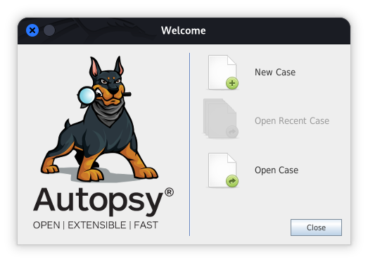

# 🔍 Autopsy Portátil - Full Forensics Suite

<p align="center">
  
</p>

---

## 🇨🇴 Español | 🇺🇸 English

### 🇨🇴 Descripción (ES)
Este repositorio ofrece una solución **Portable y Plug & Play** de Autopsy, optimizada específicamente para **Kali Linux**. El objetivo es garantizar el éxito inmediato para cualquier investigador forense: sin configuraciones complejas, solo clonar y ver la magia en acción.

### 🇺🇸 Description (EN)
This repository provides a **Portable & Plug & Play** Autopsy solution, specifically optimized for **Kali Linux**. Our goal is to ensure immediate success for any forensic investigator: no complex setups, just clone and watch the magic happen.

---

### ✨ Características | Features

* **🇨🇴 Éxito Garantizado:** Diseñado para funcionar "out-of-the-box" en entornos Debian/Kali.
* **🇺🇸 Guaranteed Success:** Designed to work out-of-the-box in Debian/Kali environments.
* **🇨🇴 Todo en Uno:** Incluye binarios esenciales (Autopsy, Tesseract-OCR, GStreamer y Volatility).
* **🇺🇸 All-in-One:** Includes essential binaries (Autopsy, Tesseract-OCR, GStreamer, and Volatility).
* **🇨🇴 Cero Dependencias:** El entorno está listo para procesar evidencias desde el primer segundo.
* **🇺🇸 Zero Dependencies:** Ready to process evidence from second one.

---

### 🚀 Instalación y Uso | Quick Start

```bash
# 1. Clonar el repositorio / Clone the repository
git clone [https://github.com/Lupo-SysAdmin/Autopsy-Portatil.git](https://github.com/Lupo-SysAdmin/Autopsy-Portatil.git)

# 2. Acceder al directorio / Enter the directory
cd Autopsy-Portatil

# 3. Ejecutar la herramienta / Run the tool
chmod +x run.sh
./run.sh
```

### ⚖️ Legal Disclaimer
This project is an unofficial portable distribution. **Autopsy®** and **The Sleuth Kit®** are registered trademarks of their respective owners. This installer and its modifications are provided under the **Apache License 2.0**.
